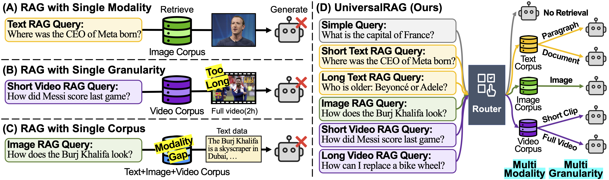

# UniversalRAG: Retrieval-Augmented Generation over Corpora of Diverse Modalities and Granularities
  
[](https://arxiv.org/abs/2504.20734)
[](https://universalrag.github.io)
[](https://www.python.org/downloads/release/python-3100/)

**UniversalRAG** is a novel RAG framework that retrieves across multiple modalities and granularities by introducing a *modality-aware routing mechanism* that dynamically identifies the most appropriate modality-specific corpus for each query, effectively addressing the limitations posed by modality gaps and fixed-granularity retrieval.



---

## Get Started

1. Clone this repository.
```bash
git clone https://github.com/wgcyeo/UniversalRAG.git
cd UniversalRAG
```
2. Install dependencies in a new conda environment.
```bash
conda create -n universalrag python=3.12 -y
conda activate universalrag
pip install torch torchvision
pip install -r requirements.txt
```
3. Download and preprocess the datasets.
```bash
bash script/0_dataset.sh
```

## Preprocessing

To preprocess data corpora, we use [InternVideo](https://github.com/OpenGVLab/InternVideo) as a multimodal encoder. Begin by cloning the repository and following the [setup instructions](https://github.com/OpenGVLab/InternVideo/tree/main/InternVideo2/multi_modality) to install the required dependencies. Once set up, define the `INTERNVIDEO_PATH` environment variable to point to the root directory of the cloned repository:
```bash
export INTERNVIDEO_PATH="path/to/internvideo"
```
We additionally utilize the [bge-large-en-v1.5](https://huggingface.co/BAAI/bge-large-en-v1.5) model as a text-specific encoder to extract text embeddings, leveraging our modality-aware routing mechanism.

Then, run the following command to extract embeddings for all queries and corpora across diverse modalities:
```bash
bash script/1_preprocess.sh
```
Change `CUDA_DEVICES` variable in the script to match the available GPUs on your system.

## Routing

### Training

To train the training-based routers (e.g., DistilBERT or T5-Large), run the following script:
```bash
bash script/2_train.sh {model-name}
```
Replace `{model-name}` with the desired router model. Supported options are `distilbert` and `t5-large`.

### Inference

To perform routing queries using either training-free (e.g., GPT-4o) or training-based routers, run:
```bash
bash script/3_route.sh {model-name}
```
Replace `{model-name}` with the appropriate router model. Supported options are `gpt`, `distilbert` and `t5-large`.

## Evaluation

To generate results for routed queries, run the following script:
```bash
bash script/4_eval.sh \
    --model_path {model-path} \
    --router_model {router-model} \
    --target {target}
```
* `{model-path}`: Path or identifier of the LVLM model to use (e.g., `OpenGVLab/InternVL2_5-8B`).
* `{router-model}`: Router model to use for routing (same as in the routing stage).
* `{target}`: Target dataset for evaluation (e.g., `mmlu`).

Use `bash script/4_eval.sh -h` to see all available options and descriptions.

Example:
```bash
bash script/4_eval.sh \
    --model_path OpenGVLab/InternVL2_5-8B \
    --router_model distilbert \
    --target mmlu
```

## Citation

If you find this work useful, please consider citing our paper:

```bibtex
@article{yeo2025universalrag,
  title={UniversalRAG: Retrieval-Augmented Generation over Corpora of Diverse Modalities and Granularities},
  author={Yeo, Woongyeong and Kim, Kangsan and Jeong, Soyeong and Baek, Jinheon and Hwang, Sung Ju},
  journal={arXiv preprint arXiv:2504.20734},
  year={2025}
}
```