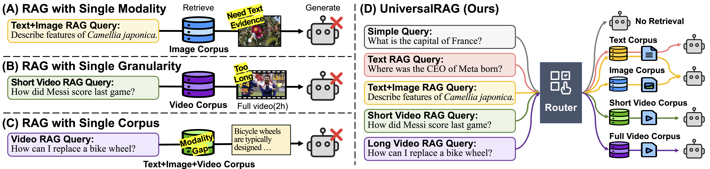

# UniversalRAG: Retrieval-Augmented Generation over Corpora of Diverse Modalities and Granularities
  
[](https://arxiv.org/abs/2504.20734)
[](https://universalrag.github.io)
[](https://www.python.org/downloads/release/python-3120/)

**UniversalRAG** is a novel any-to-any RAG framework that retrieves across multiple modalities and granularities by introducing a *modality-aware routing mechanism* that dynamically identifies the most appropriate modality-specific corpus for each query, effectively addressing the limitations posed by modality gaps and fixed-granularity retrieval.



---

## Get Started

To set up the environment, we recommend using [uv](https://docs.astral.sh/uv/) for a fast and deterministic setup. All dependencies are specified in `pyproject.toml` and pinned in `uv.lock`.

1. Clone this repository.
```bash
git clone https://github.com/wgcyeo/UniversalRAG.git
cd UniversalRAG
```
2. Install dependencies with uv and activate the virtual environment.
```bash
uv sync
source .venv/bin/activate
```
3. Download and preprocess the datasets. This step may take a while because it downloads and preprocesses large datasets.
```bash
bash script/0_dataset.sh
```

## Preprocessing

Run the following command to extract embeddings for all queries and corpora across diverse modalities:
```bash
bash script/1_preprocess.sh
```
Set the `CUDA_DEVICES` variable (e.g., `CUDA_DEVICES="0 1 2 3"`) to match the GPUs available on your system.

## Routing

### Training

To train a training-based router (e.g., Qwen3-VL-2B-Instruct or T5Gemma 2 270M), run:
```bash
bash script/2_train.sh {model-name}
```
Replace `{model-name}` with the desired router model. Supported options are `qwen3-vl-2b`, `internvl3_5-1b`, and `t5gemma-270m`.

> [!WARNING]
> To use T5Gemma 2, install Transformers v5 or later:
> ```bash
> uv pip install "transformers>=5"
> ```

### Inference

To route queries with either a training-free router (e.g., GPT-5) or a training-based router, run:
```bash
bash script/3_route.sh {model-name}
```
Replace `{model-name}` with the router model to use. The supported training-free option is `gpt-5`; training-based options are `qwen3-vl-2b`, `internvl3_5-1b`, and `t5gemma-270m`.

## Evaluation

To generate results for routed queries, run the following script:
```bash
bash script/4_eval.sh \
    --model-path {model-path} \
    --router-model {router-model} \
    --target {target}
```
* `{model-path}`: Path or identifier of the LVLM model to use (e.g., `Qwen/Qwen3-VL-8B-Instruct`).
* `{router-model}`: Router model name used in the routing stage (e.g., `gpt-5`, `qwen3-vl-2b`, `internvl3_5-1b`, or `t5gemma-270m`).
* `{target}`: Target dataset for evaluation (e.g., `mmlu`).

Use `bash script/4_eval.sh -h` to see all available options and descriptions.

Example:
```bash
bash script/4_eval.sh \
    --model-path Qwen/Qwen3-VL-8B-Instruct \
    --router-model qwen3-vl-2b \
    --target mmlu
```

## Citation

If you find this work useful, please consider citing our paper:

```bibtex
@inproceedings{yeo2026universalrag,
  title     = {UniversalRAG: Retrieval-Augmented Generation over Corpora of Diverse Modalities and Granularities},
  author    = {Yeo, Woongyeong and Kim, Kangsan and Jeong, Soyeong and Baek, Jinheon and Hwang, Sung Ju},
  booktitle = {Proceedings of the 64th Annual Meeting of the Association for Computational Linguistics (Volume 1: Long Papers)},
  month     = {July},
  year      = {2026},
  pages     = {3843-3871}
}
```
